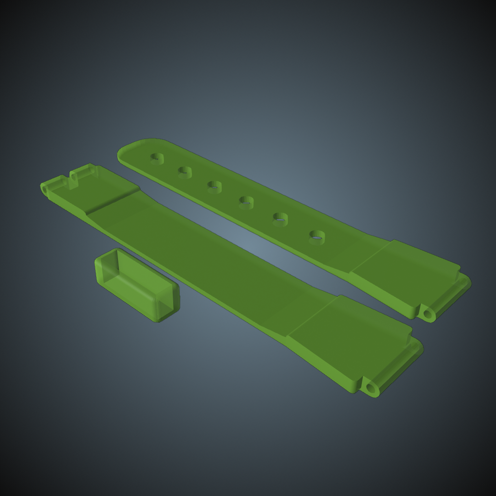
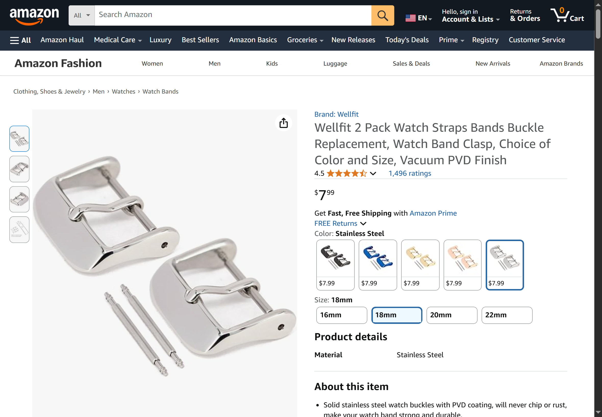
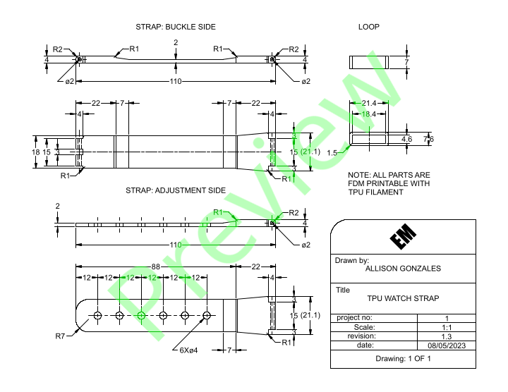

# 3D Printable Watch Band

Download from Printables here: [`Download Link`]()

### Summary

Watch strap/band that is printed with TPU.

## Print Settings

- **Layers and perimeters**
	- **Horizontal shells**
		- Solid layers:
			- Top: 1
			- Bottom: 1

- **Infill**
	- Density: 10%
	- Pattern: Aligned Rectilinear
	- Angle: 0°

## Bill of Materials

- One watch body
- Two watch spring bars
- One watch strap buckle

## Assembly

- Insert one spring bar through the hole located at the wider part of each strap, ensuring the bars are evenly through the widths of the straps.
- Depress the spring bar attached to the adjustment strap and place it into the lower strap slot on the watch body.
- Slide the strap loop over the buckle strap.
- Separate the watch strap buckle into three parts.
- Ensure the buckle strap is facing in the same direction as it was printed, with the detailed side facing up.
- Insert the spring bar from left to right through the first knuckle on the strap.
- Place the watch strap buckle tongue in between the first and second knuckle, ensuring the end of the tongue terminates down.
- Push the spring bar through the tongue and second knuckle, ensuring the bar is evenly through the width of the strap.
- Depress the spring bar and clasp the buckle onto the buckle end of the strap. Ensure that the buckle tongue is above the buckle, and that the buckle terminates down.
- Depress the spring bar attached to the buckle strap and place it into the upper strap slot on the watch body.

### Troubleshooting

If the vertical shells delaminates along the watch strap sides, try adjusting the Infill/perimeters overlap. I recommend setting this value between `75%` and `100%`. 75% is the default configuration used in the 3MF file. This setting can be found under the following:

- **Print Settings**
	- **Advanced**
		- **Overlap**
			- Infill/perimeters overlap

## A Note from the Designer

Hi! Thanks for checking out my model! This watch band is an improvement on one of my first 3D models and prints. I hope to make further strap designs available in the future. If you've printed and assembled this design, I'd love to see it. As always, if you have any issues with the original model, please let me know, and you can even open an issue on this model's [`GitHub`](https://github.com/EvokeMadness/watch-band) page.

## Previews

